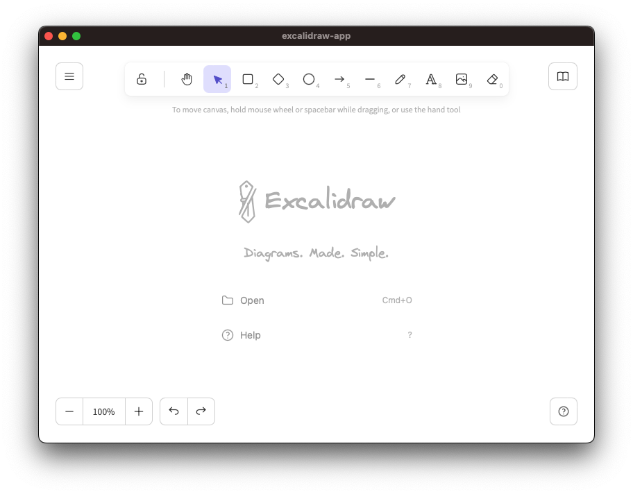

# excalidraw-app

`excalidraw-app` is an Excalidraw client on Tauri.


## How to use


```sh
$ git clone https://github.com/naotsugu/excalidraw-app.git
$ excalidraw-app
```

Run npm install

```sh
$ npm install
```

Install the `tauri-cli`

```sh
$ cargo install tauri-cli
```

Execute application

```sh
$ cargo tauri dev
```




Build installer / bundle


```sh
$ cargo tauri build
```


